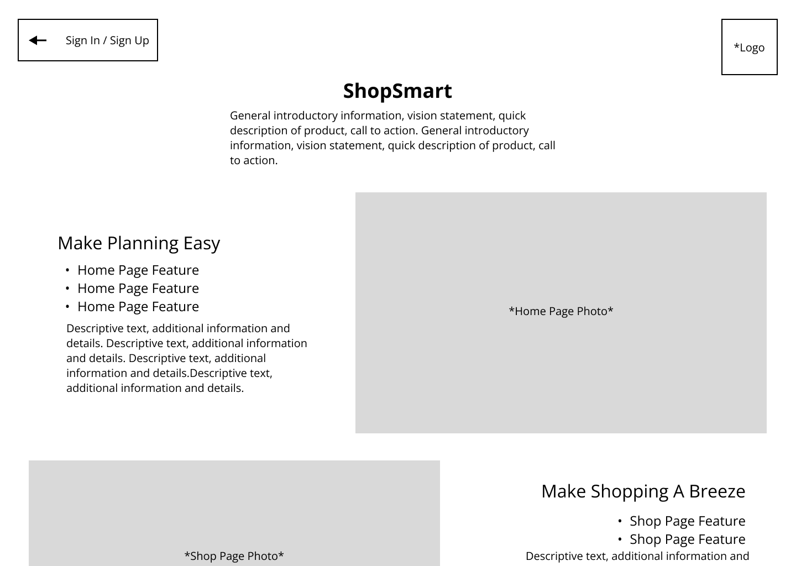

# Shop Smart - Web Pages Design

## Landing Page - Login
### Description
The landing page will introduce new users to the application. It will allow the user to enter an email to sign up for a new account, navigate to the login page for an existing account, or navigate to the about page for more information about the application.  It will display the ShopSmart app logo, brand messaging, and a few feature highlights of the application.  After login, the user will be redirected to their home page. 

Desktop: 

Mobile: 

### Parameters
- ShopSmart logo
- Fields for username and password
- Sign In Button
- Sign Up Button
- Learn More Button

### Data to Render Page
- Logo image & file path
- CSS file for consistent style
- user credential data (mock data for MVP)

### Link Destinations
- "Sign In" button destination: account page.
- "Sign-Up" button destination: account page.
- "Learn More" button: about page.

### List of Verification Tests
- Email field accepts valid characters.e
- Button functionality:
    - Sign In: Verify redirect to account page with log-in fields present
    - Sign Up: Verify redirect to account page with sign-up fields present and email prefilled with user input from landing page
    - Learn More Button: Redirects user to the about page. 

## Account Page
### Description
The account page will allow existing users to login to their account or new users to create an account with ShopSmart.  After a successful new account is created, or a validated log-in, the new user will be redirected to the homepage.

Desktop: 

Mobile: 

### Parameters
- ShopSmart logo
- New Account fields:
    - Email
    - First Name
    - Last Name
    - Password Creation
- "Start Shopping" (account creation) button
- "Sign In" Button
    - Swaps the form fields to include only Email and Password Inputs

### Data to Render Page
- Logo image & file path
- CSS file for consistent style
- user credential data (mock data for MVP)

### Link Destinations
- "Start Shopping" button: user homepage.
- "Sign Up"/"Sign In": swaps the form fields and button 

### List of Verification Tests
- New account fields accept valid characters
- Log In fields accept valid characters
- User password is hidden from display
- Create account button validates new user data before creating a new homepage.
- Upon successful from validation and submission, user is redirected to homepage.
- Sign In / Sing Up button presents corresponding form to user
- Error Handling:
    - Incorrect login/password credentials & accompanying error message.
    - Submission with empty fields.

## About Page
### Description
- The about page will contain a brief description of the ShopSmart app, display example home and shop pages with feature descriptions to explain how it can be used for the efficient management of commonly purchased items, and will contain a button back to the landing page. 

Desktop: 

Mobile: 

### Parameters
- ShopSmart Logo
- "Sign In / Sign Up" Button

### Data to Render Page
- Product desciption .txt file
- FAQ .txt file
- CSS file for consistent style

### Link Destinations
- "Sign In / Sign Up" button: landing page 

### List of Verification Tests
- Verify that any product description or feature descriptions are functional.
- Verify that the Sign In / Sign Up button redirects to landing page

## Home Page
### Description
The home page will allow the user to manage their items and stores. It will allow users to add an item to a main list of unassigned items, create store groups to assign items to, and assign items from the unassigned list to a store.   

Desktop: 

Mobile: 

### Parameters
- Shop Smart Logo
- Home Button
- Shop Button
- Log Out Button
- Add an item data entry field
- Unassigned item container
- Store containers
- Add a Store button

### Data to Render Page
- Shop Smart Logo img file
- User item data
- User store data
- CSS file: home page styling

### Link Destinations
- Home Page Button: links to self (refresh)
- Shop Page Button: links to shop page
- Log Out Button: redirects to landing page

### List of Verification Tests
- Validate that all buttons redirect to the appropriate page. 
- Validate that the add an item data entry field validates acceptable inputs.
- Validate that new items are added to the unassigned list.
- Validate that existing items (in database) are re-activated and assigned to the correct store.
- Validate that items assigned to a store are removed from the unassigned list and added to the correct store.
- Validate that the add a store feature adds a new store.

## Shop Page
### Description
The shopping page will allow the user to create a "shopping trip". If there is no active trip, the user will be able to select a specific store's items, all items, or unassigned items. Once a trip is created, the user will have access to a checklist(s) of items based on their previous selection.  User's can check off items as they shop. When done, users can complete their trip, to remove items from their associated list.

Desktop: 

Mobile: 

### Parameters
- Home Page Button
- Shop Button
- Logout Button
- List container of store/group options
- List container of items in chosen store
- List container of unassigned items
- Individual item containers with checkboxes
- Complete Trip button

### Data to Render Page
- Shopsmart img file
- User item data
- User store data
- User trip data
- CSS file: shopping page styling

### Link Destinations
- Home Button: links to home page
- Shop Button: links to self (refresh)

### List of Verification Tests
- Validate that all of the users stores are available for selection.
- Validate that all active items assigned to a store appear in the item list when a store is selected
- Validate that all active unassigned items are present in the unassigned list
- Validate that items are marked 'shopped' when checked off of the list.
- Validate that all link buttons redirect to the appropriate page. 
- Validate that the Complete Trip marks the store trip complete
- Validate that the user is prompted to confirm that the trip is complete, when the complete trip button is clicked before all shhopped items are removed from their respective lists.

