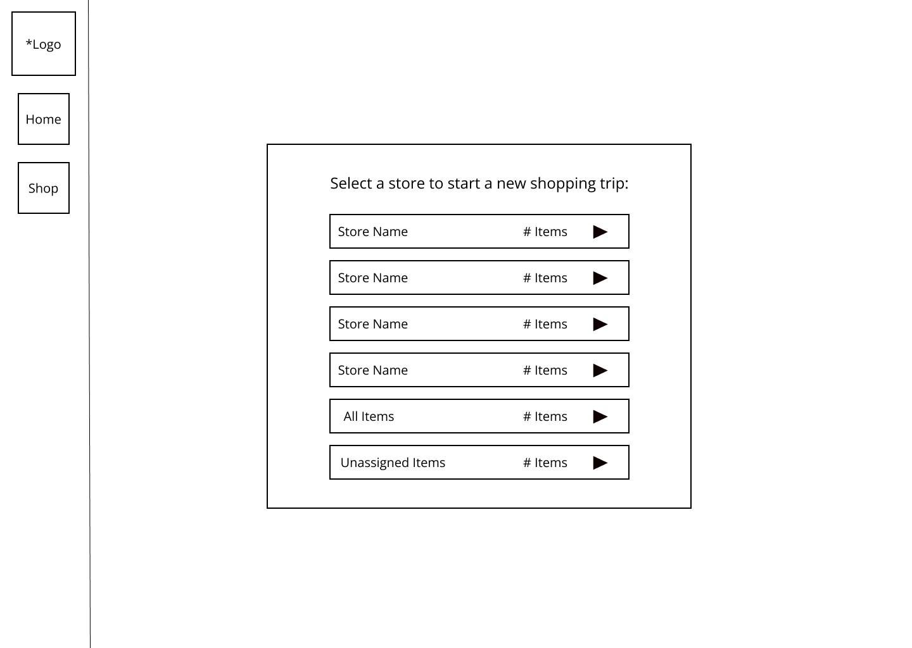

# Shop Smart - Web Pages Design

## Landing Page - Login
### Description
The login page will allow the user to enter a username/password for an existing account or sign up for a new account if one does not already exist.  It will display the ShopSmart app logo.  After login, the user will be taken to their home page. 

Desktop: 

Mobile: 

### Parameters
- ShopSmart logo
- Fields for username and password
- Login Button
- New Account Button
- Drop down menu
    - About Page Button

### Data to Render Page
- Logo image & file path
- CSS file for consistent style
- user credential data (mock data for MVP)

### Link Destinations
- Login button destination: user homepage.
- New account button destination: signup page.
- About button: about page.
### List of Verification Tests
- Username and password entry fields accept valid characters.
- Verify that successful login redirects to user's home page.
- Verify that dropdown feature expands to reveal the About Page button with hover/click.
- Button functionality:
    - Login: Verify success only with valid credentials.
    - New Account: Navigates to the correct page.
    - Dropdown feature: Expands to reveal the about page button with hover/click.
    - About Page Button: Redirects user to the about page. 
- Error Handling:
    - Incorrect login/password credentials & accompanying error message.
    - Submission with empty fields.

## New Account Page
### Description
The new account page will allow new users to create an account with ShopSmart.  After a successful new account is created, the new user will be redirected to the homepage with empty containers and will be prompted to add a new item to get started with the application. 

Desktop: 

Mobile: 

### Parameters
- ShopSmart logo
- New Account fields:
    - First Name, Last Name
    - City, State and Zipcode
    - Username Creation
    - Password Creation
- Create Account Button
- Menu Dropdown
    - About Page Button
- Existing User Button

### Data to Render Page
- Logo image & file path
- CSS file for consistent style
- user credential data (mock data for MVP)

### Link Destinations
- Create Account Button Destination: user homepage.
- About Page Button Destination: about page.
- Existing User Button Destination: login page. 

### List of Verification Tests
- New account fields accept valid characters
- Create account button validates new user data before creating a new homepage.
- Upon successful validation, create account button takes user to homepage.
- About Page Button and Existing User Button redirects to appropriate page successfully.

## About Page
### Description
-The about page will contain a brief description of the ShopSmart app, how it can be used for the efficient management of commonly purchased items, answer frequently asked questions, and will contain a link to the login and new account pages. 

Desktop: 

Mobile: 

### Parameters
-ShopSmart Logo
- Create Account Button
- Menu Dropdown
    - About Page Button
- Existing User Button

### Data to Render Page
- Product desciption .txt file
- FAQ .txt file
- CSS file for consistent style

### Link Destinations
- Create Account Button Destination: user homepage.
- About Page Button Destination: about page.
- Existing User Button Destination: login page. 

### List of Verification Tests
- Verify that any product description or FAQ dropdowns are functional.
- Verify that the drop down menu and about page buttons are functional. 
- Verify that the new and existing account buttons are functional and redirect to the appropriate page.

## Home Page
### Description
The home page will allow the user to add an item to an unassigned list of common purchases.  A list of common purchases that have been assigned
to a store will also be displayed.  The user will be able to add a new store to the list of commonly visited retailers.  

Desktop: 

Mobile: 

### Parameters
- Menu Button:
    - Dropdown Items:
        - Shopping Page Button
        - About Button
        - Logout Button
- Add an item data entry field
- Unassigned item container
- Item containers
- Store containers
- Add a Store container / button
- Home Page Header
- Shop Smart Logo

### Data to Render Page
- Shop Smart Logo img file
- User item data (mockup for MVP)
- User store data (mockup for MVP)
- CSS file: home page styling

### Link Destinations
- Shopping Page Button: links to shopping page
- About Page Button: links to About Page

### List of Verification Tests
- Validate that all buttons redirect to the appropriate page. 
- Validate that the add an item data entry field validates acceptable inputs.
- Validate that new items are added to the unassigned list.
- Validate that existing items are assigned to the correct store.
- Validate that new items assigned to a store are added to the correct store when assigned.
- Validate that the add a store feature adds a new store.
- Validate that new items can be added to a new store.
## Shopping Page
### Description
The shopping page will allow the user to access lists specific to each store that contains commonly purchased items.  The user will have access to a checklist of shopping items.  After completing the shopping list, the user can mark the trip complete. 

Desktop: 

Mobile: 

### Parameters
- Menu Button:
    - Dropdown Items:
        - Home Page Button
        - About Button
        - Logout Button
- List container of stores
- List container of items in chosen store
- List container of unassigned items
- Individual item containers
- Complete Trip button

### Data to Render Page
- Shopsmart img file
- User item data (mockup for MVP)
- User store data (mockup for MVP)
- CSS file: shopping page styling
### Link Destinations
- Home Page Button: links to home page
- About Page Button: links to About Page
### List of Verification Tests
- Validate that all of the users stores are available for selection.
- Validate that commonly purchased items appear in the item list when a store is selected
- Validate that unassigned items are added to a store when selected and assigned.
- Validate that items are marked 'shopped' when checked off of the list.
- Validate that the selected store is highlighted.
- Validate that all link buttons redirect to the appropriate page. 
- Validate that the Complete Trip marks the store trip complete and changes the color of the selected store tab.
- Validate that the user is prompted to confirm that the trip is complete, when the complete trip button is clicked before all shopping items are marked 'shopped'.

